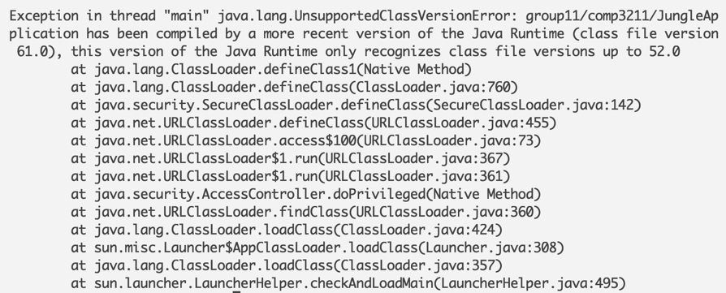
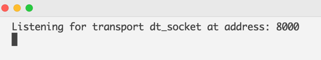
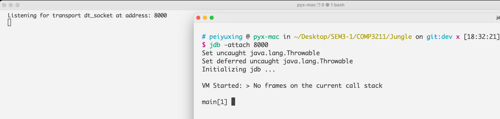

# Jungle

COMP3211 Software Engineering Group Project "Jungle" - 2022 Fall

Implemented by Group11

Contributors: Yuxing PEI, Suizhi MA, Jiaming HAN, Yunfei LIU

GitHub: [Jungle](https://github.com/xyliax/Jungle) - Link to the upstream

## Description

Jungle / Dou Shou QI (斗兽棋), is a modern Chinese board game with an obscure history.
This project is a console/command line based implementation of Jungle with exquisite GUI.
For more knowledge about Jungle, please visit [Jungle (board game)](https://en.wikipedia.org/wiki/Jungle_(board_game)).
<br>
This document serves as a manual, describing details about the followings.

* As a player
  * How to START / PLAY this game
  * How to INSTALL this game
  * How to UPDATE previously installed game
* As a developer
  * How to VIEW / EDIT the source code
  * How to COMPILE / BUILD the project
  * How to TEST the source code
  * How to start the game in DEBUG mode
  * How to IMPROVE our game
* How to interpret common ERROR messages
* And most importantly, how to provide COMMENTS to the other developer

## Prerequisites

### JDK 17

Java 17 LTS is the latest long-term support release for the Java SE platform. <br>
For this project, you must fulfill this requirement. <br>
Otherwise, you will get error messages at starting like this:


If you are seeing this error message, please upgrade your jdk version to at least 17.

### *nix Platform

In this game, we have adopted conventions defined in *nix / POSIX standard.
If you can only use Windows, there are two alternative options for you.

1. Set up a Linux environment using virtual machine (WSL, VirtualBox, VMWare...)
2. Use Docker (will be described in details later)

We strongly recommend you to use *nix system, because the compatability issues may not be considered as complete as
possible. Hence, for Windows users, option 1 will work in a better manner.

### Terminal

This game is terminal based. You must have at least one terminal application / simulator to start playing.

Minimum requirement: 30 rows * 100 columns.

If your terminal does not satisfy this requirement, there are two options solving this problem.

1. Resize the terminal window
2. Resize the font size in terminal

For macOS, the
default [Terminal.app](https://support.apple.com/en-gb/guide/terminal/apd5265185d-f365-44cb-8b09-71a064a42125/mac) works
fine.

For Ubuntu, the default [Terminal.app](https://itsfoss.com/open-terminal-ubuntu/) works fine.

## For developers

### IDE

You may view and edit the source code in any IDE, the developers use IntelliJ for its strong compatibility for Maven
and package / plugins importing. But you may NOT start the application by clicking the 'start' button in IDEs, that
won't work, and you will see our kindly reminder "Please read [README](README.md) carefully".

### Shell script

In the project directory, you may find a shell script [jungle](./jungle).
Most developer options are performed by this script. (This is probably one main reason for only supporting *nix
platforms)

#### Usage (goto the project base directory)

```shell
./jungle argument?
```

while argument is an option in the followings.

#### 'help'

```shell
./jungle help
# display README.md
```

```shell
./jungle help pdf
# display README.pdf
```

```shell
./jungle help page
# display README in web page (using default browser)
```

#### 'version'

```shell
./jungle version
# display the current project version
```

#### 'build'

```shell
./jungle build
# build and run the project (build and then start the game)
```

The project will start building process using Apache Maven, if you don't have maven installed on your local
machine, we will automatically use our provided [maven](lib-maven/apache-maven-3.8.6-bin.tar.gz) for building.
A reminder message will show up if this is the case. Noted if this happens, you may need to wait for 1-2
minutes, because maven will fetch some plugins from maven central, and this process usually depends on you network
connection. So be patient if you don't have maven preinstalled in you local machine. After the first build, this
process will be much faster.

Note that this command will clean all the previously built targets, so technically this is 'rebuild and run'

#### 'test'

```shell
./jungle test
# build and start unit tests in the whole project
```

Note that this command will not start the game, just finish the unit tests, the result will be displayed.

#### 'clean'

```shell
./jungle clean
# clean all generated targets, including classes, jars, basically anything in target/ directory
```

#### 'install' && 'uninstall'

```shell
sudo ./jungle install
# install ./jungle to /usr/local/bin and set $JUNGLE_HOME
```

```shell
sudo ./jungle uninstall
# remove /usr/local/bin/jungle
```

Note these two commands are NO longer recommended in current version. They require root, and are implemented by
naive undergraduates instead of formal package managers. Their functions, are replaced by popular package managers
like Homebrew and apt-get...

If you are interested in installing Jungle, we have cleaner methods for you.

#### 'debug'

```shell
./jungle debug
# start the project in debug mode
```

After running this command, you will see something like this:


Then, you should open another terminal window to start [jdb](https://man.cx/jdb(1))


Seeing something like that means you have successfully attached Jungle to jdb, and you may start debugging using jdb
commands.

#### No argument

```shell
./jungle
# start the game directly
```

Before running this command, you must have built the project for at least ONE times. Check if target/ directory
exists. If not, you must build the project first.

### Use jungle-app-maker

In the project directory, you may find a shell script [jungle-app maker](jungle-app-maker).

This is a "magic" shell script that can combine the executable jar along with startup environment settings together
into a single executable file.

#### Usage

```shell
cat jungle-app-maker target/Jungle-1.0-SNAPSHOT.jar > jungle-app && chmod +x jungle-app
# generate jungle-app
```

After doing this, you will find an executable file [jungle-app](jungle-app).

```shell
./jungle-app
# Start the game!
```

The jungle-app-maker makes developers much easier for publishing their own software!

## For Players

The players are free to follow th above steps, but we have provided more user-friendly methods for those who don't
want to deal with compiling and building.

### Homebrew

Homebrew is available on macOS and Linux (x86).

#### Preparation

[what is Homebrew](https://brew.sh/)

If you don't have Homebrew installed before, paste the command in your terminal.

```shell
/bin/bash -c "$(curl -fsSL https://raw.githubusercontent.com/Homebrew/install/HEAD/install.sh)"
```

#### Installation

Paste the commands in the terminal.

The game will be automatically installed.

```shell
brew tap xyliax/homebrew-tap
brew install xyliax/tap/jungle
```

To start the game, use this command.

```shell
jungle-app
```

To update the game, use this command.

```shell
brew reinstall xyliax/tap/jungle
```

This command will reinstall jungle-app from GitHub repository.

### Get the executable

We have provided releases on GitHub.

#### Release Binaries

[jungle-app](https://github.com/xyliax/Jungle/releases/download/test-developers/jungle-app)

```shell
wget https://github.com/xyliax/Jungle/releases/download/test-developers/jungle-app
chmod +x jungle-app
```

And you are free to start the game.

```shell
./jungle-app
```
